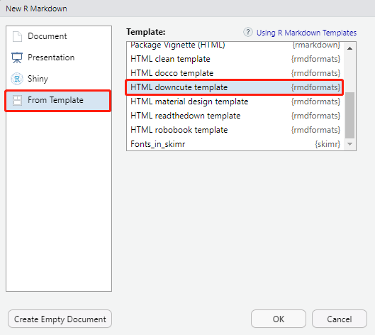

```{r setup, include=FALSE}
## Global options
knitr::opts_chunk$set(cache = TRUE)
```

# Question Restate

- Go through “R for Beginners” if you are not familiar with R programming.
- Use knitr to produce at least 3 examples. For each example,
texts should mix with figures and/or tables. Better to have
mathematical formulas.

# 一个我觉得挺好看的模板

## 安装模板库

```{r eval=FALSE}
install.packages("rmdformats")
```

## 调用模板

### Method1: New R Markdown From Template



### Method2: Change R Markdown Head manually

```
---
title: "Try knitr"
date: "`r Sys.Date()`"
output:
  rmdformats::downcute:
    self_contained: true
    default_style: "light"
    downcute_theme: "default"
---
```

## 效果预览


左侧为目录栏，支持明暗主题切换，右侧为正文，相较于默认风格更加美观。

# 表格与公式演示

## 使用`knitr::kable`演示表格

```{r}
grade = data.frame(name = c("小明","小红","小方"), chinese = c(90,89,93), math = c(88,95,89), english = c(94,95,91))
```

```{r}
knitr::kable(grade)
```

## 总分公式

$$total = chinese + math + english$$

```{r}
grade$total = grade$chinese + grade$math + grade$english
knitr::kable(grade)
```

## 更复杂的公式

### 行内公式

二重积分换元法$\iint_D f(x,y) dxdy = \iint_{D'}f(x(u,v),y(u,v))|\frac{\partial(x,y)}{\partial(u,v)}|dudv$常被用于计算积分区域较为特殊的二重积分。

### 行间公式

高斯公式：
$$\oint_S v \cdot dS = \iiint_V \nabla \cdot v dV$$

高斯公式将第二型曲面积分转化为体积分。

# ggplot2画图展示

tidyverse是一个集中了数据预处理、新的数据类型(tibble)、画图等功能于一体的包集合，我感觉可以说tidyverse让R成为了另一种语言。


```{r message = FALSE}
library(tidyverse)
```

```{r}
mpg %>% 
  ggplot(aes(x=class, y=hwy, fill=class)) + 
  geom_boxplot()
```


